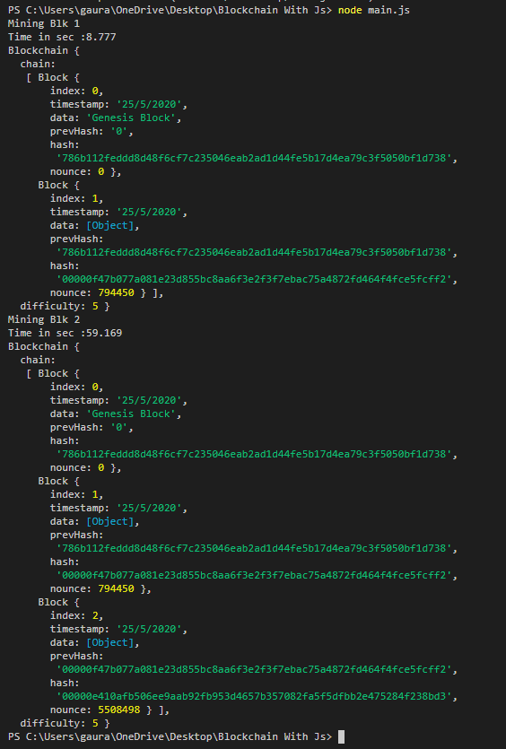

# Blockchain-With-Js
 Very basic functions of Blockchain, implemented in Typescript

# Author
> Gaurav Kabra

# Installation
In VS Code, open terminal and type : <br>
```
npm install --save crypto-js
```
This will provide cryptographic libraries.

# Running
In VS Code, open terminal and type : <br>
```
node main.js
```

# Live Demonstration
[Here](https://andersbrownworth.com/blockchain/blockchain)

# Sample ScreenSave
